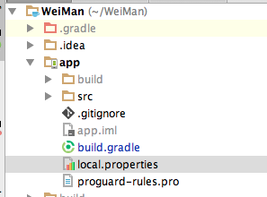
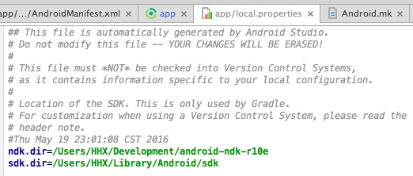

微漫说明文档
==============

### 项目配置说明

#### 项目依赖包
+ sharesdk
+ floatButton
+ opencv-java
+ build.gradle文件的dependencies标签的所有

#### 项目配置流程
1. 使用新的git地址：http://git.oschina.net/xionghuang/ASWeiMan。原来的已经舍弃，需要重新拉取。
2. 在app目录下新建local.properties文件（如有不存在），在文件中写入以下两行，第一行是NDK的地址，第二行是Android SDK地址。修改成自己电脑上对应的位置。

		ndk.dir=/Users/HHX/Development/android-ndk-r10e
		sdk.dir=/Users/HHX/Library/Android/sdk

3.  打开app module 下的Android.mk文件，将

		include /Users/HHX/packge/OpenCV-2.4.9-android-sdk/sdk/native/jni/OpenCV.mk
		
替换为本地位置Opencv位置。

### DEVELOPERS

黄汉雄：15626470641